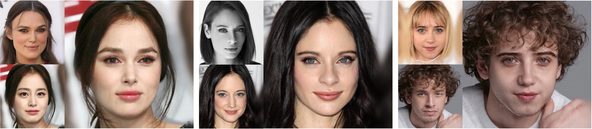

  <h1>🍎APPLE: Attribute-Preserving Pseudo-Labeling for Diffusion-Based Face Swapping</h1>

  

    <a href="https://scholar.google.com/citations?user=A2PurdIAAAAJ&hl=en">Jiwon Kang1</a>
    ·
    <a href="https://scholar.google.com/citations?user=IWvP0A4AAAAJ&hl=en">Yeji Choi1</a>
    ·
    <a href="https://scholar.google.com/citations?user=0H3dcPoAAAAJ&hl=en">JoungBin Lee1</a>
    ·
    <a href="https://scholar.google.com/citations?user=7cyLEQ0AAAAJ&hl=en/">Wooseok Jang1</a>
    ·
    Jinhyeok Choi1
    ·
    Taekeun Kang2
    ·
    Yongjae Park2
    ·
    Myungin Kim2
    ·
    <a href="https://cvlab-kaist.ac.kr/">Seungryong Kim1</a>
  

  

    1KAIST AI &nbsp; 2SAMSUNG
  

  <h3><a href="https://arxiv.org/abs/2601.15288">Paper</a> | <a href="https://cvlab-kaist.github.io/APPLE/">Project Page</a></h3>

  

## Abstract
Face swapping aims to transfer the identity of a source face onto a target face while preserving target-specific attributes such as pose, expression, lighting, skin tone, and makeup. However, since real ground truth for face swapping is unavailable, achieving both accurate identity transfer and high-quality attribute preservation remains challenging. Recent diffusion-based approaches attempt to improve visual fidelity through conditional inpainting on masked target images, but the masked condition removes crucial appearance cues, resulting in plausible yet misaligned attributes due to the lack of explicit supervision. To address these limitations, we propose **APPLE** (**A**ttribute-**P**reserving **P**seudo-**L**ab**e**ling), a diffusion-based teacher–student framework that enhances attribute fidelity through attribute-aware pseudo-label supervision. We reformulate face swapping as a conditional deblurring task to more faithfully preserve target-specific attributes such as lighting, skin tone, and makeup. In addition, we introduce an attribute-aware inversion scheme to further improve detailed attribute preservation. Through an elaborate attribute-preserving design for teacher learning, **APPLE** produces high-quality pseudo triplets that explicitly provide the student with direct face-swapping supervision. Overall, **APPLE** achieves state-of-the-art performance in terms of attribute preservation and identity transfer, producing more photorealistic and target-faithful results.
